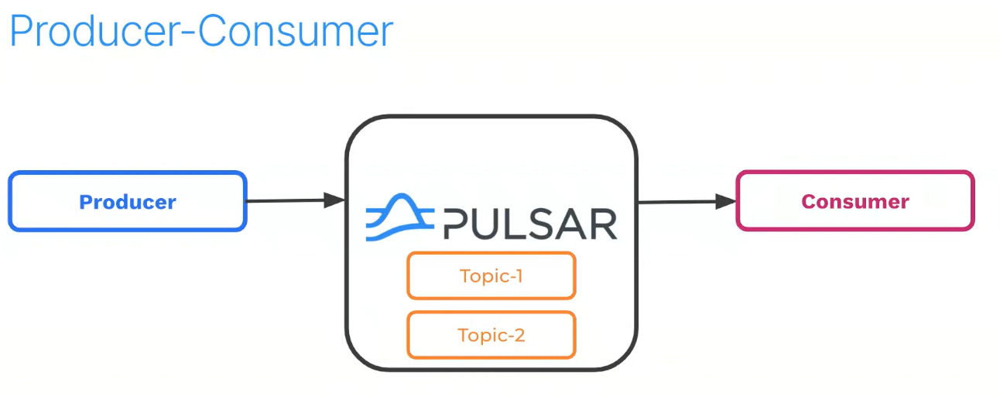
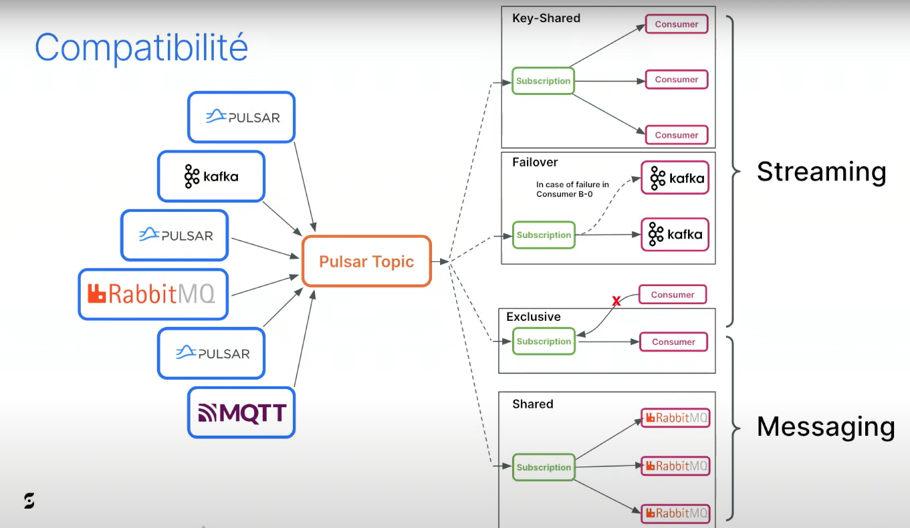
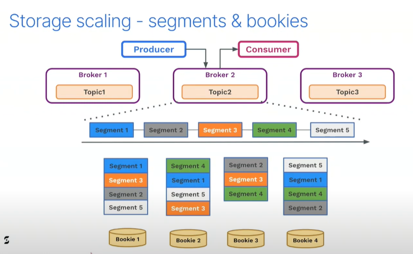
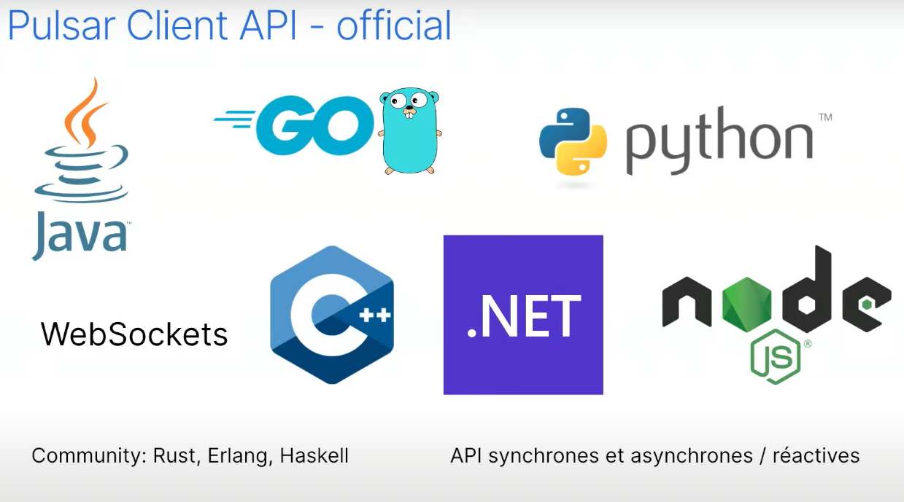

# Apache_pulsar

Démarrer apache pulsar via Docker

```docker run -it -p 6650:6650 -p 8080:8080 --mount source=pulsardata,target=/pulsar/data --mount source=pulsarconf,target=/pulsar/conf apachepulsar/pulsar:2.11.0 bin/pulsar standalone```

Download apache pulsar : 
[Link to download Apache pulsar](https://pulsar.apache.org/docs/2.11.x/getting-started-standalone/)


<br>
<h2>Messagerie</h2>

  

<br>
<h2>Les points clef d'apache pulsar </h2>

## la différence entre le messaging et le streaming


## Plateforme unifié messaging + streaming
<br>


## Scalabilité
<br>


## Multi tenant
<br>
 

<br>

## Compatibilité avec l'écosystem
 

<br>

[video tchi jug](https://www.youtube.com/watch?v=B2w9DSyviW0&t=1229s)
source tchi jub - Julien Jakubowski